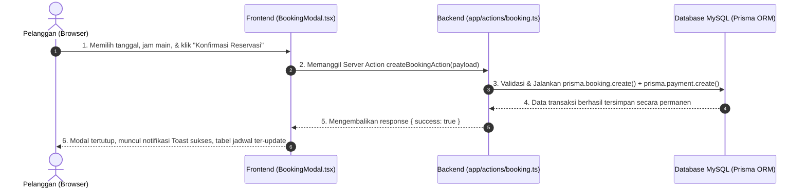

# 🏟️ Dokumentasi Arsitektur: Frontend & Backend Booking Lapangan

Dokumen ini menjelaskan struktur arsitektur, pemisahan peran antara **Frontend** dan **Backend**, serta alur komunikasi data pada aplikasi web **Booking Lapangan Olahraga**.

---

## 💡 1. Konsep Fullstack Next.js Monorepo

Aplikasi ini dibangun menggunakan **Next.js (App Router)** dengan pola *Unified Fullstack Monorepo*. Artinya, kode antarmuka pengguna (Frontend) dan logika server/database (Backend) berada dalam satu repository, namun dipisahkan secara tegas melalui instruksi:

- `"use client"`: Menandakan kode berjalan di sisi **Browser / Client (Frontend)**.
- `"use server"`: Menandakan kode berjalan di sisi **Node.js Server (Backend)**.

---

## 🎨 2. Lapisan FRONTEND (Client-Side / UI & Interaksi)

Bagian Frontend bertugas merender tampilan antarmuka (UI/UX), mengelola animasi, merespon interaksi pengguna, dan mengontrol status lokal (seperti membuka/menutup modal, filter pencarian, dan input form).

### 📁 Pemetaan File Frontend:

| File / Direktori | Peran & Deskripsi |
| :--- | :--- |
| [`app/page.tsx`](file:///home/yusuf/projekan/Pelatihan%20Bpvp/booking_lapangan/app/page.tsx) | **Landing & Auth Page:** Tampilan antarmuka Login dan Registrasi minimalis (Google OAuth & Email/Password). |
| [`app/dashboard/page.tsx`](file:///home/yusuf/projekan/Pelatihan%20Bpvp/booking_lapangan/app/dashboard/page.tsx) | **Portal Member (Single File):** Halaman utama pelanggan yang memuat kartu katalog lapangan, modal booking pemesanan, tombol keluar, dan tabel riwayat transaksi langsung dalam 1 file program yang rapi dan mudah dipelajari. |
| [`app/dashboard/admin/page.tsx`](file:///home/yusuf/projekan/Pelatihan%20Bpvp/booking_lapangan/app/dashboard/admin/page.tsx) | **Panel Pengelola Admin (Single File):** Dashboard admin untuk memantau pendapatan, validasi/konfirmasi pesanan masuk, dan pengelolaan master lapangan langsung dalam 1 file program. |
| [`lib/auth-client.ts`](file:///home/yusuf/projekan/Pelatihan%20Bpvp/booking_lapangan/lib/auth-client.ts) | **Client Auth SDK:** Library Better Auth di browser (`useSession`, `signIn`, `signUp`, `signOut`). |

---

## ⚙️ 3. Lapisan BACKEND (Server-Side, Logika Bisnis & Database)

Bagian Backend berjalan 100% di server Node.js. Kode ini **tidak pernah terekspos ke browser**, aman untuk menyimpan kredensial/secret, dan bertugas mengeksekusi query database.

### 📁 Pemetaan File Backend:

| File / Direktori | Peran & Deskripsi |
| :--- | :--- |
| [`app/actions/booking.ts`](file:///home/yusuf/projekan/Pelatihan%20Bpvp/booking_lapangan/app/actions/booking.ts) | **Server Actions (`"use server"`):** Kumpulan fungsi API backend (RPC) untuk CRUD data lapangan, pembuatan booking, dan update status. |
| [`app/api/auth/[...all]/route.ts`](file:///home/yusuf/projekan/Pelatihan%20Bpvp/booking_lapangan/app/api/auth/[...all]/route.ts) | **Route Handler (REST API):** Endpoint HTTP untuk menangani callback autentikasi Better Auth & Google OAuth. |
| [`lib/auth.ts`](file:///home/yusuf/projekan/Pelatihan%20Bpvp/booking_lapangan/lib/auth.ts) | **Server Auth Engine:** Konfigurasi autentikasi server, hashing kata sandi, adapter database, dan manajemen session. |
| [`lib/prisma.ts`](file:///home/yusuf/projekan/Pelatihan%20Bpvp/booking_lapangan/lib/prisma.ts) | **Koneksi Database:** Inisialisasi instance singleton Prisma Client dengan driver adapter MariaDB/MySQL. |
| [`prisma/schema.prisma`](file:///home/yusuf/projekan/Pelatihan%20Bpvp/booking_lapangan/prisma/schema.prisma) | **Skema Database Relasional:** Definisi struktur tabel database MySQL (`User`, `Customer`, `Lapangan`, `Booking`, `Payment`). |

---

## 🤝 4. Jembatan Penghubung (Data Contracts)

Untuk menjamin *Type Safety* dan mencegah *runtime error*, Frontend dan Backend dihubungkan oleh kontrak tipe TypeScript:

- [`types/booking.ts`](file:///home/yusuf/projekan/Pelatihan%20Bpvp/booking_lapangan/types/booking.ts):
  - `Lapangan`: Kontrak tipe data arena olahraga.
  - `BookingWithRelations`: Kontrak tipe data reservasi beserta relasi user, lapangan, dan pembayaran.
  - `Customer`: Kontrak tipe data profil penyewa.
  - `Payment`: Kontrak tipe data transaksi pembayaran.

---

## 🔄 5. Diagram Alur Komunikasi Data

---

## 📊 6. Ringkasan Perbedaan Frontend vs Backend

| Aspek | Frontend (Client-Side) | Backend (Server-Side) |
| :--- | :--- | :--- |
| **Tempat Berjalan** | Web Browser Pengguna | Server Node.js |
| **Bahasa / Format** | TSX, React Hooks, Tailwind CSS, HTML | TypeScript, Server Actions, Prisma ORM, SQL |
| **Akses Database** | ❌ Tidak boleh langsung |  Boleh langsung & aman |
| **Direktif File** | `"use client"` | `"use server"` |
| **Tanggung Jawab** | Desain, interaktivitas, dan UX | Logika bisnis, validasi, dan keamanan data |
